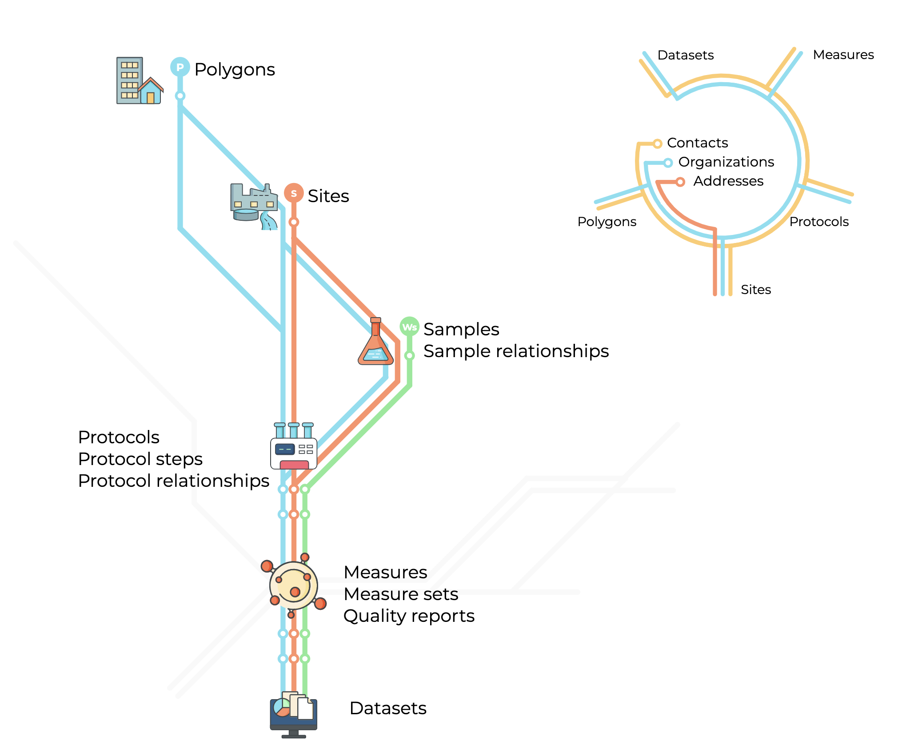
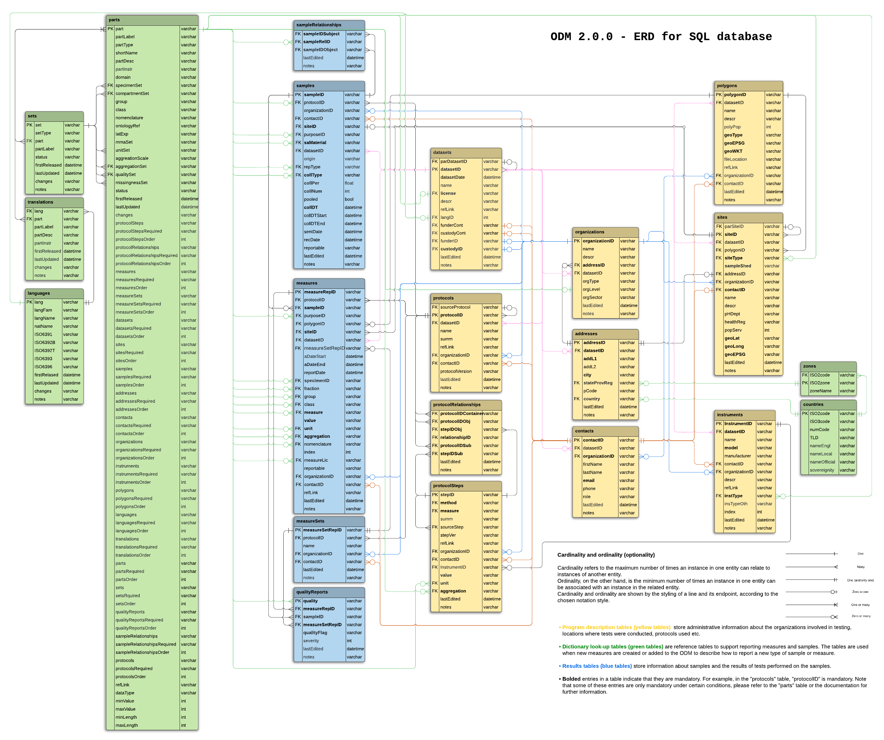

#  The Public Health Environmental Surveillance Open Data Model (PHES-ODM, or ODM)

<!-- badges: start -->

<!-- badges: end -->

## Description

PHES-ODM began as an open data model for wastwater-based surveillance of SARS-CoV-2. PHES-ODM Version 2 expands the original ODM to include surface and air testing, in addition to water. Version 2 also include robust support for reporting any biologic, toxin, or other health risks.

The ODM strives to improve wastewater surveillance through interoperable data. The ODM follows an open science approach, including including [FAIR Guiding Principles](https://www.go-fair.org/fair-principles/). Uses an Open software approach, including operates with the guidance of an international [steering committee](https://github.com/Big-Life-Lab/covid-19-wastewater/wiki). People and institutions can contribute to the development of the ODM and the ODM seeks to support a wide range of users.

**[ODM documentation website](https://docs.phes-odm.org)** is the main source of information for the ODM.
The documentation website includes:

- An introduction the ODM.
- A quick start guide.
- How-to guides.
- Background and explantaory guide to how the ODM works.
- The reference files in searchable, human readible format.
- Links to other resources.

## This repository includes

- **[Dictionary reference files](dictionary-tables)** for all ODM versions.
- **[Scripts](src)** to set up an SQL relational database for the ODM schema.
- **[Roadmap and work-in-progress](roadmap.md)**.
- **[How to contribute](#colloborate)**.
- **[Code of conduct](CODE_OF_CONDUCT.md)**.
- **[Acknowledgements](#acknowledgements)**.
- **[Steering committee minutes](https://github.com/Big-Life-Lab/PHES-ODM/wiki)**.

## Data and metadata dictionary

The ODM is comprised of 15 report tables and six look-up tablea, linked to each other based on logic relationships. The following figure provides an overview of the different data sources that are currently captured.

## Collaborate

See [contributing](CONTRIBUTING.md) and [Code of conduct](CODE_OF_CONDUCT.md) for more information.

- Issues, suggestions and pull requests are welcomed. use [GH issues](https://github.com/Big-Life-Lab/covid-19-wastewater/issues), the [ODM Discourse channel](https://odm.discourse.org) or email [phesd_odm@ohri.ca](mailto::phes_odm@ohri.caa).
- Follow the [`dev`](https://github.com/Big-Life-Lab/covid-19-wastewater/tree/dev) branch for upcoming changes. Also follow version changes in [issues](https://github.com/Big-Life-Lab/covid-19-wastewater/issues), [discussions](https://github.com/Big-Life-Lab/covid-19-wastewater/discussions), and [projects](%3Chttps://github.com/Big-Life-Lab/covid-19-wastewater/projects).
- [An international steering committee](https://github.com/Big-Life-Lab/PHES-ODM/wiki/Steering-Group-Members) guides the development of the data model.
- Working groups consist of a regular weekly meeting with ODM developers and users. Add hoc working groups are created to develop specific sections of the ODM. An example of the working group the development of quality assurance and control measures.

## Keep in touch

Subscribe to OMD newletters to receive e-mails about new releases, working group announcements or general updates. [here](https://us20.list-manage.com/survey?u=dd9d7217c4c3932d1ee9ffcfe&id=917b821107&attribution=false).

Questions? E-mail at [phesd_odm@ohri.ca](mailto::phesd_odm@ohri.ca).

## Application

PHES ODM is used or planned for use in 23 countries. Programs that use or are implementing the ODM include the European Union's Digital European Exchange Platform (DEEP), Canada's National Microbiology Laboratory (NML), Ontario's Wastewater Initiative by the Ministry of Environment, Conservation, and Parks (MECP), uOttawa, le Centre québécois de recherche sur la gestion de l'eau, Université Laval.

ODM forms part other platforms and tools including:
- [CETO Epidemiologic platform](https://ceto.ca).
- [Ottawa Automatic Data Pipelines](https://phes-odm.org).

## Work-in-progress

See [GitHub projects](https://github.com/Big-Life-Lab/PHES-ODM/projects) for work-in-progress and a roadmap of upcoming enhancements.

## License

Website content is published under a Creative Commons CC BY 4.0 license, which requires users to attribute the source and license type (CC BY 4.0) when sharing PHES-ODM content.

See [license](LICENSE) for more information.

## Acknowledgements

Development and maintenance of the ODM is the result of a collaboration between researchers from multiple institutions:

- The [University of Ottawa]()
- [CIHR Coronavirus Variants Rapid Response Network (CoVaRR-Net)](https://covarrnet.ca)
- Université Laval
- CHEO Research Institute
- modelEAU
- CentrEau - Centre québécois de recherche sur la gestion de l'eau
- Public Health Agency Canada
- Ministry of Environment, Conservation, and Parks - MECP Ontario
- European Union DG Joint Research Centre
- The Ottawa Hospital Research Institute
