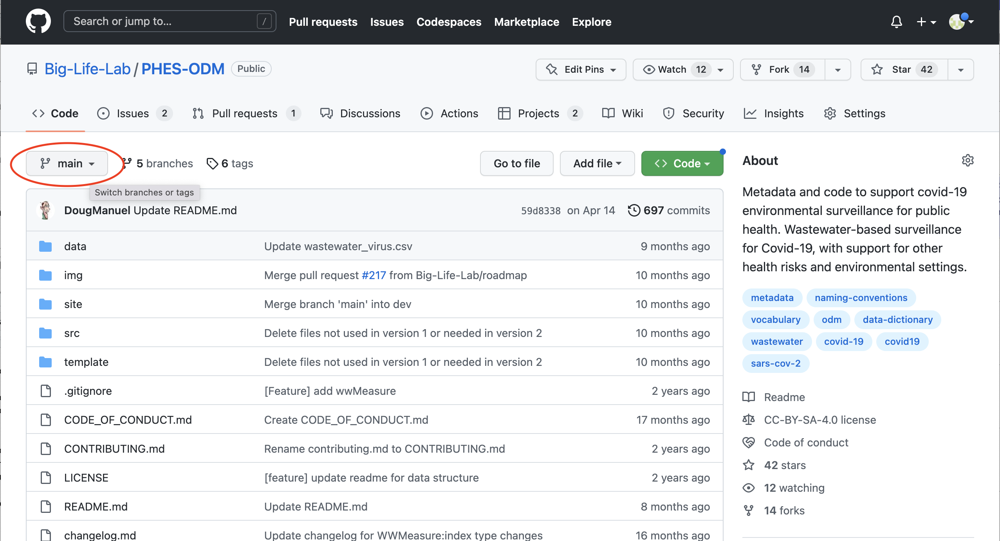
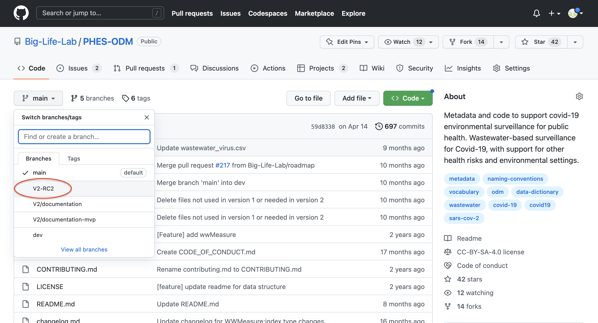
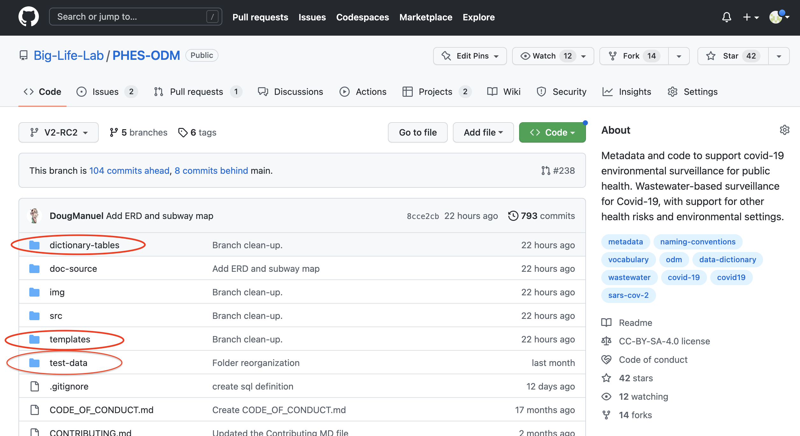
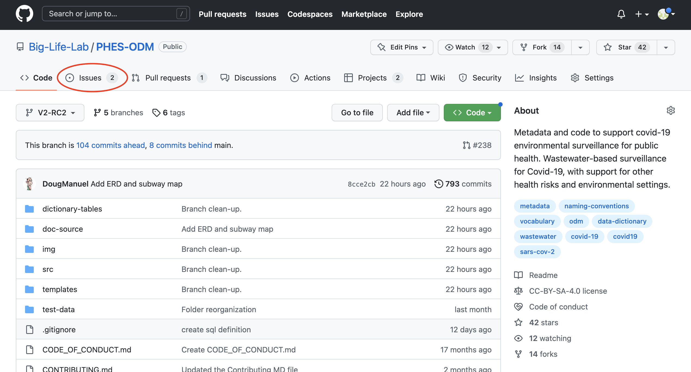
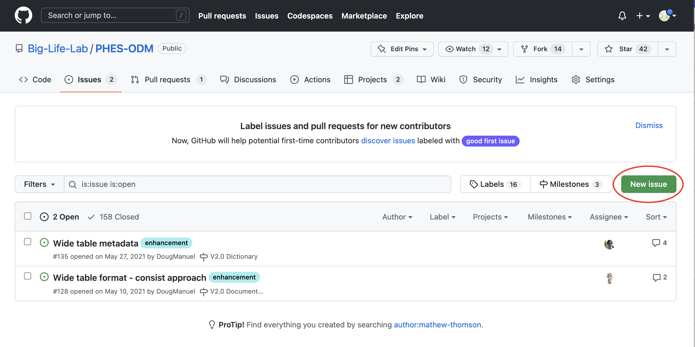
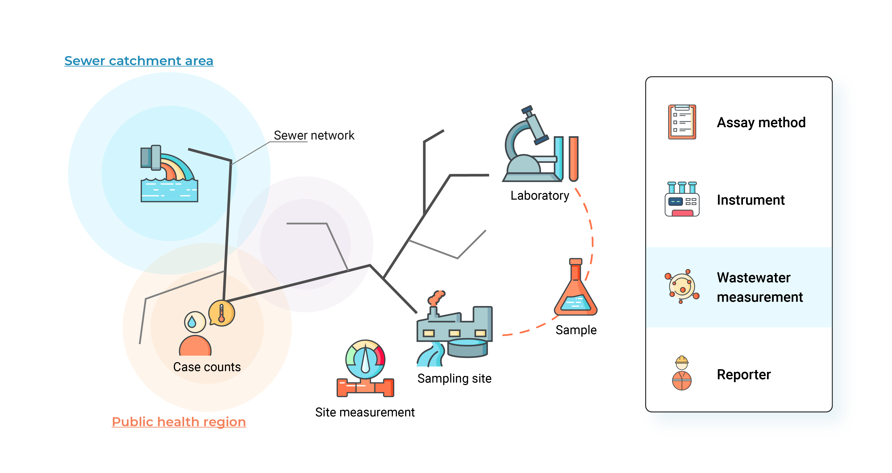
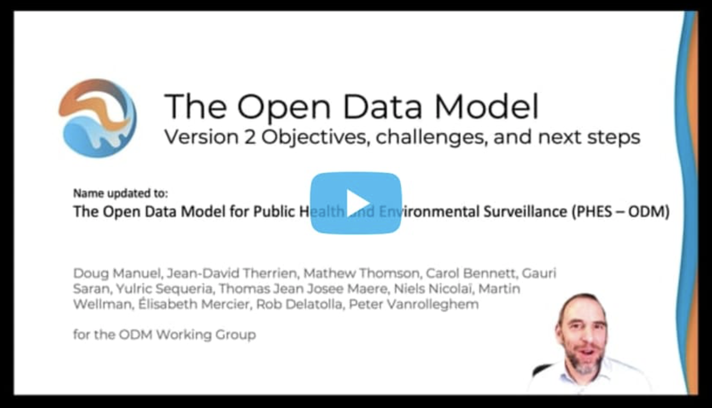

#  The Public Health Environmental Surveillance Open Data Model (PHES-ODM, or ODM)

<!-- badges: start -->

<!-- badges: end -->

## Description

PHES-ODM began as an open data model for wastwater-based surveillance of SARS-CoV-2. PHES-ODM Version 2 (in progress) expands the original ODM to include surface and air testing, in addition to water. The new PHES-ODM v2 also include robust support for reporting any biologic, toxin, or other health risk.

This repository includes:

- A relational **dictionary** that captures wastewater based surveillance data and metadata. It consists of 150+ variables categorized in 10 tables;
- **Documentation** describing how to use the data model;
- **Template files** that can be used to record data in the ODM format;
- **Scripts** to set up a relational database according to the ODM schema.

## NEW - Reviewing Release Candidate 2.0 for version 2.0.0 of the ODM

To review the structure proposed for version 2.0.0 of the ODM, and the changes between the new version and the original version, please review the files in the [V2-RC2 Branch](https://github.com/Big-Life-Lab/PHES-ODM/tree/V2-RC2).

To navigate to a different branch, you'll need to click on the drop down menu at the top of the page (see image below).

From there, select the branch named "V2-RC2 Branch" (see image below).

This will take you to the branch for the current release candidate for version 2.0.0 of the ODM. Once here,we invite you to look and read through the contents of these three folders (see image below) to become better acquainted with the proposed new version.

If you have any questions, comments, or concerns about the proposed new structure, you can create a new GitHub issue by navigating to the issues tab (see image below).

and then clicking on "new issue" (see image below).

We look forward to receiving and reviewing community feedback, which is essential to the collaborative and community-driven spirit of the PHES-ODM project.

## Background

Wastewater-based surveillance (WBS) of SARS-CoV-2 is developing and expanding rapidly during the current COVID-19 pandemic. WBS has demonstrated itself as valuable public health tool with an increasing number of municipalities that have identified new SARS-CoV-2 transmission using wastewater testing prior to clinical testing. Wastewater testing has also identified new surges and waves that has informed early public health response. Internationally, there are over 2000 testing sites in over 50 countries.

WBS has a history informing public health action through its use to monitor health threats such as polio, antimicrobial resistance, as well as illicit drugs, among others. However, as a surveillance tool for pandemic purposes, the program is relatively new and there are implementation gaps. Currently, there is little to no controlled vocabulary on how WBS results should ideally be reported. Hence, the idea of a WBS data model that captures all relevant fields that should ideally be reported on when sharing WBS data.

The ODM strives to improve wastewater surveillance through the development of an open data structure, including metadata and vocabulary. ODM operates under the guidance of an international [steering committee](https://github.com/Big-Life-Lab/covid-19-wastewater/wiki). Working groups can be ongoing or created to address specific tasks and projects. Note that we adhere to the [FAIR Guiding Principles](https://www.go-fair.org/fair-principles/) with recognition of benefit from a common data structure, including metadata and vocabulary.

## Data and metadata dictionary

The ODM is comprised of ten primary tables and one lookup table, linked to each other based on logic relationships. The following figure provides an overview of the different data sources that are currently captured.

See [metadata](metadata_en.md) for more detailed information on variable names and definitions. Cliquez [ici](metadata_fr.md) pour la version française.

## Collaborate

See [contributing](CONTRIBUTING.md) and [Code of conduct](CODE_OF_CONDUCT.md)for more information.

- Issues, suggestions and pull requests are welcomed. GH issues](https://github.com/Big-Life-Lab/covid-19-wastewater/issues) or email [phesd_odm@ohri.ca](mailto::phes_odm@ohri.caa).
- Follow the [`dev`](https://github.com/Big-Life-Lab/covid-19-wastewater/tree/dev) branch for upcoming changes. Also follow version changes in [issues](https://github.com/Big-Life-Lab/covid-19-wastewater/issues), [discussions](https://github.com/Big-Life-Lab/covid-19-wastewater/discussions), and [projects](%3Chttps://github.com/Big-Life-Lab/covid-19-wastewater/projects).
- [An international steering committee](https://github.com/Big-Life-Lab/PHES-ODM/wiki/Steering-Group-Members) guides the development of the data model.
- Working groups consist of a regular weekly meeting with ODM developers and users, called the [core-user working group](https://github.com/Big-Life-Lab/PHES-ODM/wiki/Core-User-Working-Group). Add hoc working groups are created to develop specific sections of the ODM. An example of the working group the development of quality assurance and control measures.

## Keep in touch

Subscribe to OMD newletters to receive e-mails about new releases, working group announcements or general updates. [here](https://us20.list-manage.com/survey?u=dd9d7217c4c3932d1ee9ffcfe&id=917b821107&attribution=false).

Questions? E-mail at [phesd_odm@ohri.ca](mailto::phesd_odm@ohri.ca).

## Application

PHES ODM is used or planned for use in 23 countries. Programs that use or are implementing the ODM include the European Union's Digital European Exchange Platform (DEEP), Canada's National Microbiology Laboratory (NML), Ontario's Wastewater Initiative by the Ministry of Environment, Conservation, and Parks (MECP), uOttawa, le Centre québécois de recherche sur la gestion de l'eau, Université Laval, and [CETO Epidemiologic platform](https://ceto.ca).

## Work-in-progress

What's coming to version 2.0.

An overview of the features and structure of version 2.0 to date.

The presentation used in the first video is [here](https://docs.google.com/presentation/d/1aPUdgtmywJU5L1e8O4loiFtTnV8gAefN/edit?usp=sharing&ouid=103619232413193034528&rtpof=true&sd=true). The presentation is updated with developments of ODM v2. The contents can be reused under the license of this repository. 

See [Work-in-progress and roadmap](roadmap.md) for more details.

## License

Website content is published under a Creative Commons CC BY 4.0 license, which requires users to attribute the source and license type (CC BY 4.0) when sharing PHES-ODM content.

See [license](LICENSE) for more information.

## Acknowledgements

Development and maintenance of the ODM is the result of a collaboration between researchers from multiple institutions:

- [CIHR Coronavirus Variants Rapid Response Network (CoVaRR-Net)](https://covarrnet.ca)- uOttawa
- The Ottawa Hospital
- Université Laval
- CHEO Research Institute
- modelEAU
- CentrEau - Centre québécois de recherche sur la gestion de l'eau
- Public Health Agency Canada
- Ministry of Environment, Conservation, and Parks - MECP Ontario
- European Union DG Joint Research Centre

## References

Nicolaï N., Therrien J.-D., Maere. T, Pileggi V., Swerdfeger H., Vanrolleghem P.A., Manuel D. (2021) Open Data Model for collecting, quality-ensuring and sharing of SARS-CoV-2 data and metadata, EU4S Sewage Sentinel System for SARS CoV-2 - 5th Town Hall Meeting, e-poster, https://api.ltb.io/show/ABCWX
