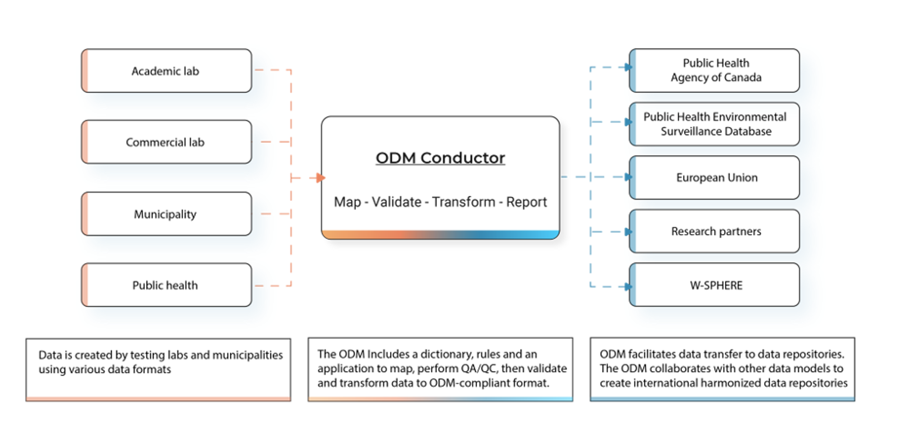
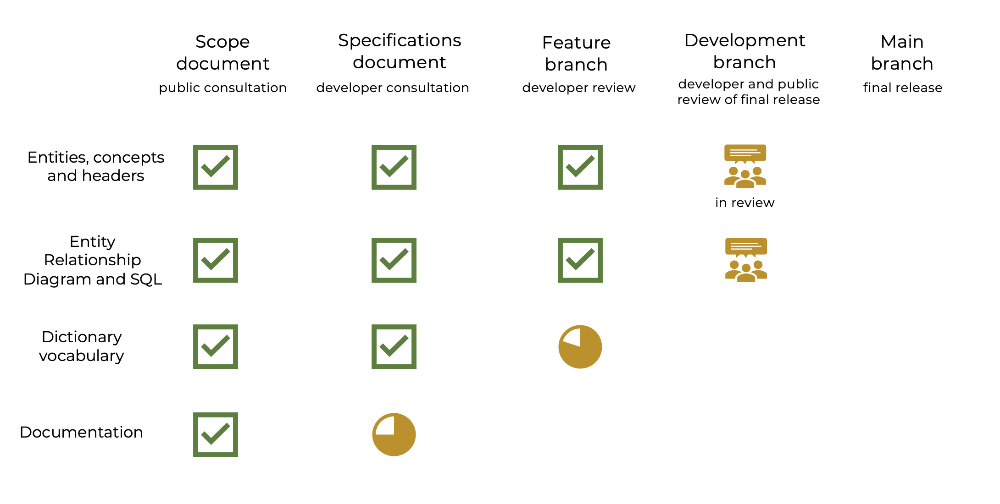

# Work-in-progress and roadmap

See the [Roadmap](https://github.com/Big-Life-Lab/covid-19-wastewater/projects/3?add_cards_query=is%3Aopen) project for progress on the roadmap. Add new items or discuss on the discussion [thread](https://github.com/Big-Life-Lab/covid-19-wastewater/discussions/108). Issues with "future" tag are discussed for addition to the roadmap.

[Project Scope Statement for the ODM](https://docs.google.com/document/d/1QPSTi3zdY5eUQ62eOxSDMVyJBiKa2HEzKHEAnBzpRYA/edit) - The scoping document to support the roadmap and version 2.

## Requirements

Requirements for future tools and features:

- **Multilanguage support** - Provisions international language support for all metadata.
- **Open and cross platform** - Tools to support the data model will be generated using or support open software. The objective is to create pseudo-code that can form the basis to program code in R or Python. Rules as pseudo-code allow development teams to generate consistent data applications in other program platforms (i.e. MS 365 or ArcGIS).
- **Support exisiting dictionaries** - PHES-ODM seeks to include measures and concepts from other common dictionaries.

## Version 2

Version 2 has three objectives.

Development of Version 2 is in progress. Key additions include:

- **Data dictionary** - Ensure the data dictionary is comprehensive, robust and extendable.
- **Support tools** - Make it as easy as possible to use the data model with tools to transform, validate and share data.
- **Improved documentation** - Documentation includes tutorials, how-to-guides, explaination and reference guides.

### Version 2 dictionary

The extended version 2 dictionary includes a structured, extendable approach to include:

- Any biologic, chemical or property.

- Air and surface testing, in addition to wastewater (water).

  - variants, mutations, sequences, proteins

- Other biologics (including antimicrobial resistance), drugs and toxins and properties.

- Expanded ability to report methods, instruments, and quality control and assurance measures.

- Large data – i.e data streaming of wastewater flow or temperature.

- Comprehensive – include all measures in other wastewater dictionaries.

  - CDC National Wastewater Surveillance System, European Nucleotide Association, Norman Score, etc.

### Version 2 support tools

- Excel templates.

  - Long-versions – One measure per row with sheets for data from sites, samples, quality control

- Map - Map your existing data to ODM. Map ODM to other common dictionaries.

- Validate - checks and reports whether your data meets ODM format.

  - Automatic
  - Extra validation rules can be added (CSV file).
  - Python library supported, with a schema that can be implemented in other systems.

- Share - filter your data to felicitate sharing just the data you want to share for different groups

  - Sharing to the individual data element.

  - Template provided (CSV), then you customize

### The Conductor

The conductor is a web-based application, under development, that brings the ODM tools to wastewater labs and others who collect and use wastewater and environmental testing data.

### Version 2 milestones

#### Dictionary progress - December 16, 2022

#### Vocabulary progress - December 16, 2022

#### December 2021​

- Robust relational dictionary, with entity relationship diagram and SQL logic​

- Data sharing schema and Python application​

- Validation schema​

- Multi-language support​

#### January 2022​

- Excel data collection templates for partners​

- Complete open database​

- Initial documentation to support users in implementing version 2​

#### March 2022​

- Support tools (mappers, validators, and the conductor)​

- Robust documentation (vignettes, tutorials, references, and how-to guides)

## Documentation

Documentation that including tutorials, how-to guides, technical references and explanations. See [Divio documentation approach](https://documentation.divio.com).

1. Tutorials - learning-oriented.
1. How-to guides - problem-oriented.
1. Explanation - understanding-oriented.
1. Reference - information-oriented.

## Process

- the PHES-ODM Steering Committee and Working Groups ensures PHES-ODM meets the needs from the full spectrum of users from testing laboratory to public health policy.
- A working group that meets weekly to discuss ongoing development and receive input from dictionary users. Please email: phesd_odm@ohri.ca if you would like to join the meeting.
- [Code of conduct](CODE_OF_CONDUCT.md).
