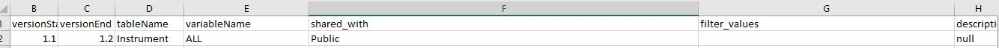
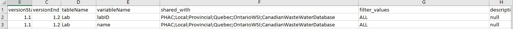
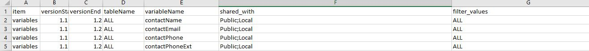
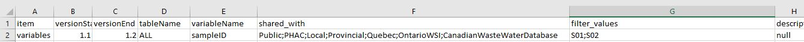
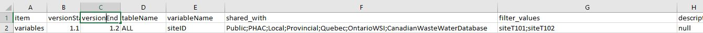
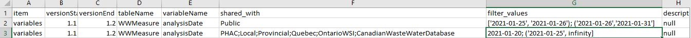

# Aim/Objective:

The purpose of the ODM is to support wastewater-based surveillance and epidemiology by facilitating the collection, standardization, and transparency of data by providing a more harmonized ODM data format to share data between different data curators and data repositories.

The ODM supports data sharing in two ways:

1. **Data sharing schema** - The ODM will have a schema that describes what data can be shared with one or more partners or users.
2. **Data filter based on the data sharing schema** - The ODM will support an open source method for filtering data tables using the data sharing schema.

The data sharing schema will be a csv file (sharing.csv) where each row in the file corresponds to one variable in a ODM table. Attributes in the row describe who the data is shared with and what data is excluded. See below for an example.

The data filter is a Python module (or function) that excludes data based on a data sharing schema. The function accepts an ODM data tables and sharing schema. The function excludes (filters) data variables and rows according to the schema rules. The function then returns a data table with only the data that is to be shared. This new, returned data is ready to be shared and used with a partner.

# Features

High level features include:

- The data custodian should be able to define all the sharing rules in a CSV file (`sharing.csv`). A standard schema for defining the rules will be developed.
- The schema should allow a data custodian to define the partner (organization or person) that each rule pertains to. For example, a certain rule may be applicable only to the Public Health Agency of Canada (PHAC) while another rule may be applicable to not only the PHAC but also to Ottawa Public Health.
- The schema should allow data custodians to define rules that applies to rows or to columns. For example, a rule can be made to exclude all the rows from the `Sample` table or to exclude the `type` column from the `Sample` table.
- Rules can be made within the context of an entire table, to a column that may be present in more than one table or to a column specific to a table.
- The rules may only be exclusive. For example, rules can be defined to remove rows but not to include them. 
- Rules can be combined to form more powerful conditions using logical operators. For example, exclude all rows with `contactEmail` equal to "john.doe@email.com" AND `contactName` equal to "John Doe". Current supported logical operators are `AND` and `OR`.
- The data custodian will be returned a report at the end which will provide details about how many rows were filtered from the data or the individuals and the reasons why they were removed.
- The data custodian will be able to define licenses on how the data can be used by specific users. In many jurisdictions, this is defined in a detailed data-sharing agreement (DSA). The DSA can be short simply referencing a license type, or they can be many pages identifying specifically who can use the data and for what purpose and what will be the data destruction protocols, etc. The license feature or sharing rule will be a free text field and the text field may reference a longer document.
- The implementation should take into account the relationship between the different tables as defined in the ODM. For example, removing a row with siteID 1 from the site table, should also remove all samples with siteID 1 from the samples table. All nested relationships should also be taken care of. The relationships between the tables can be seen [here](https://github.com/Big-Life-Lab/ODM/blob/main/metadata_en.md).
- A python function that implements these rules should be built.

### How the features will be implemented?

The ODM emphasizes open and FAIR data (Findable, Accessible, Interoperable, and Re-usable). 

### Context

- The data sharing takes place between the different data custodians that generate waste water surveillance data and the different organizations or data repositories such as Public health agency, Provincial health authorities, Local health authorities, with Quebec site, waste water database, the general public or any other person or organization. The data custodian can share only specific information with the specific data repositories by providing the rules in shared_data.csv file.
- Data custodians work with their data on different platforms. The goal is to provide them a tool that can help them share their data based on the platform they use to store their data. Most data custodians use Excel to store data. Some are also using ArcGIS and Tableau. Using a python script that can accept data based on different platforms that data custodians might use to enter the data can provide a tool and common platform to share ODM data. Alternatively, the data custodians may choose to implement the sharing rules in their own data system and not use the ODM method.
- Data will be shared by the data custodian using a web application tool where the data custodian can enter in their data and the CSV schema with their own predefined rules set for different data repositories or access groups. The back end python script will allow them to filter the data based on their provided csv schema and output back the final dataset that is ready to be shared. Pandas library in python is used for the filtration of selective variables and conditional rules that the data custodian provides. 
- The data custodian can filter specific entities such as the entire table or just an entire variable. The python script will automatically filter data for those tables or variables based on the rules defined for them. The **shared_data.csv** schema provides columns for table name (tableName) and variable name (variableName). The data custodian can mention the name of the table that they wish to exclude under the **tableName** column and if they wish to exclude all the variables from the table then they will need to write **ALL** under the **variableName** column for the particular table name.  

An example is shown above where they can selectively choose to not share the entire table named instrument with all the variables with the Public.
- To filter only specific variables from the data, the data custodian will provide the value for the variable name under the **variableName** column and corresponding table name under the **tableName** column. To filter the entire variable, the data custodian will write “ALL” under the **filter_value** column of the schema. 

The example in figure above illustrates how the data for Lab table can be selectively filtered to exclude all of ‘LabID’ and ‘name’ variables in the data. To exclude the entire variable, value of “ALL” is specified under the ‘filter_value’ sharing property.
- The data custodian will be able to exclude a particular variable from all the tables that  contain that variable name. An example will be ‘contactName’ in Reporter table and Lab table. If data custodian wishes to exclude variable ‘contactName’ from all the tables that contains it, then they will simply provide the name of the variable under **variableName** column in the schema and write “ALL” under the **tableName** column. This will exclude it from all the tables. To ensure that the entire variable is removed from all the tables, the value of “ALL” is also specified under the ‘filter_value’ column. An example is illustrated below: 

- Alternatively, they can also choose to filter all the tables with a common variable name for only specific values of that variable. In example below, all the tables that contain variable name ‘SampleID’ will be filtered to exclude all the values of SampleID equal to ‘S01’ and ‘S02’. The two different SampleID will be specified under the **filter_value** column separated by a ‘;’. 

- The data custodian can selectively choose who they don’t wish to share data with. They can exclude certain variables or specific values of a variable or the entire table from only certain access groups. They will have to provide the name of the access group they wish to exclude under the **shared_with** column in the **shared_data.csv** schema. The **shared_with** sharing property allows user to exclude specific access groups when sharing specific information. As shown in figure above the data for Reporter and Lab tables has been filtered to exclude ‘contactName’, ‘contactEmail’ variables for only the Public and Local access groups. The other access groups will still contain these variables in the final output data.
- The web application tool will provide a form to the data custodian when requesting to share data that will accept values for the names of all the access groups (could be any organization, agency or their friend) they want to share data with and the list of tables they wish to fetch data for and will be providing in as input to the form. When the data custodian wants to exclude certain information from a certain access group, then they will use the **shared_with** sharing property in the schema and enter the names of the access groups that they want to exclude data from. The name of the access group under the ‘shared_with’ column must match the name provided in the form.
- The data custodian can also selectively choose to filter out specific rows instead of columns from the data. If they wish to exclude data where the variables have a specific value or a specific range, then they will be able to use the **filter_value** sharing property in the schema to do that. 
- An example of using filter_value rule will be to filter data by a specific value of a variable. If the data custodian wants to exclude siteID data that has value of ‘siteT101’ or ‘siteT102’ from all the access groups, then they would need to provide those values for SiteID variable under the filter_value column separated by ‘;’. The semicolon is used to separate two separate values or ranges. 

- Another example will be of a range of values that they wish to filter the data. In ‘WWMeasure’ table, they can filter the ‘analysisDate’ variable for different range of date values. For range, they will provide values under the **filter_value** column again. However, the range will be provided inside mathematical notations of brackets specifying the lower and upper bounds of the limit. 
- To filter ‘analysisDate’ by excluding all the date value within the range of 25th January to 31st January but including 26th January, they will use the following notation with two ranges again separated by a ‘;’: [‘2021-01-25’, ‘2021-01-26’); (‘2021-01-26’,‘2021-01-31’]. The bracket ‘[’ and ’]’ will include the lower bound and upper bound limit in the data whereas bracket ‘(’ and ‘)’ will exclude the lower bound or the upper bound limit from the data in the two separate range specified. Data custodian can specify as many range as they want separated by a semicolon. 

- Data custodian will be allowed to selectively choose different range or filter values for different access groups. In the above example, the data custodian chooses to filter ‘analysisDate’ column by two different ranges only for Public. However, for the remaining groups the ‘analysisDate’ column is filtered by a value and a range as illustrated in figure above. It is allowed to filter values of a variable both by a range and by a specific value. In above figure, the date value of 20th January and range between 25th January to the maximum date value is filtered or excluded from the data for all the other groups except Public, but allows 25th January due to ‘(’ sign. 
- Infinity is accepted as a value. It will simply mean that the lowest or highest limit is the minimum or maximum for that variable in the data.
- Data sharing will take place once the data is in the ODM compliant format after it has gone through the validation process and has been cleaned.

### Sharing processes:

- **items -** There are several different items such as tables, variable names that will have different sharing properties or rules applied to them to selectively choose what the custodian might want to share with a particular data repository.
- **filter -** The filter can be used as a data sharing property or sharing rule that allows data custodian to selectively choose range of data values or specific values to share for specific variables in their data. As an example, the data custodian may not want to share their data for the entire time range and will only want to enter a specific timeframe for which the data can be shared. 
- **who -** The sharing property or the rule can identify who the data is intended for. Different data repositories or organizations or public or a person can have different access level to the data as per the requirements of the data custodian. The different access groups will be identified through these rules, **shared_with** that will be part of the schema in the **shared_data.csv** file. When the data custodian logs onto the web portal to use ODM tool for data sharing, they will have options to enter the names of access groups and the tables they wish to share the data with.
- **description -** There will be a description for each sharing property or rule that will specify the license or permissions on how the data or specific data elements shared with a specific recipient can or can not be used.
- **extensible -** Since the waste water surveillance is rapidly developing, it will be necessary to make the sharing process more adaptable and extensible for growing changes and processes that allows users to add more variables and rules in the schema for sharing.

### Sharing schema and rules

- The sharing schema defines the rules that will be used to selectively filter the data for the data custodians who want to share only specific part of their data with a specific data repository. The ODM will create the main schema in the **shared_data.csv** file which will be updated in each version. However, the ODM users will be able to extend or develop the schemas for their own specific applications.

- Pandas is a library in python which provides features to do extensive data manipulations including conditional filtration based on different rules. These rules are provided by the data custodian in **shared_data.csv** file which is converted into a json python object which is then used with Pandas library to select variables based on those provided rules. Having the schema for sharing in a CSV format allows non-data scientists to develop their specific data sharing specifications or rules.

- A sharing schema allows ODM users to provide consistent format for sharing data that can be used to filter data based on their specifications.

Following are the rules in the version v1.2 that are part of **shared_data.csv** file:

**tableName:** This rule will allow the user to enter the name of the table that they wish to exclude or filter the data for. If a data custodian wants to exclude a particular variable from all the tables that contains that variable name, then they can enter the value ‘ALL’ for this property and the specific variable name under the ‘variableName’ column.

**variableName**: This rule will allow the user to enter the name of variables they want to filter data for or exclude from the table. If they wish to remove all the variables for a particular table in the data, then they can enter the value of ‘ALL’ for this property and the specific table name under the ‘tableName’ column.

**shared_with:** This rule allows data custodian to enter the names of the access groups that they do not want to share specific portions of their data with. In the web application form, the data custodian will provide names of all the access groups that they want to share data with. In the schema, they can selectively choose to exclude specific portions of the data with specific groups by providing their names under the ‘shared_with’ column.

**filter_value:** This rule allows user to filter data with specific values of a variable or a specific range of values. This property can allow user to remove specific rows in the data based on a certain condition or can also remove an entire variable. To remove all the rows corresponding to an entire variable in the data, the user will need to enter ‘ALL’ value for this property. If a user wishes to remove selective rows that corresponds to specific values of a variable in the data, then they can enter those values for the particular variable name under this property. If there is more than one value it must be separated by a semicolon. An example will be ‘siteT101’;‘siteT102’ for the siteID variable. Apart from specific values, ranges are also allowed and provided within brackets where ‘[’ and ’]’ indicates including the lower and upper bound limits whereas ‘(’ and ‘)’ indicates excluding the lower and upper bound limits. More than one range can be excluded and they must be separated by a semicolon.

**description_license:** This rule will be free text column that allows user to enter the details about data sharing agreement and how the data will be used by different access groups with the permissions that each group may have for usage of data and specific variables or tables.

The data, filtered out using the above schema rules and the python script in back end that runs the Pandas package, is returned back to the user in an Excel spreadsheet along with the report that will list the number of rows removed, variables removed from each table and the reason for that.
