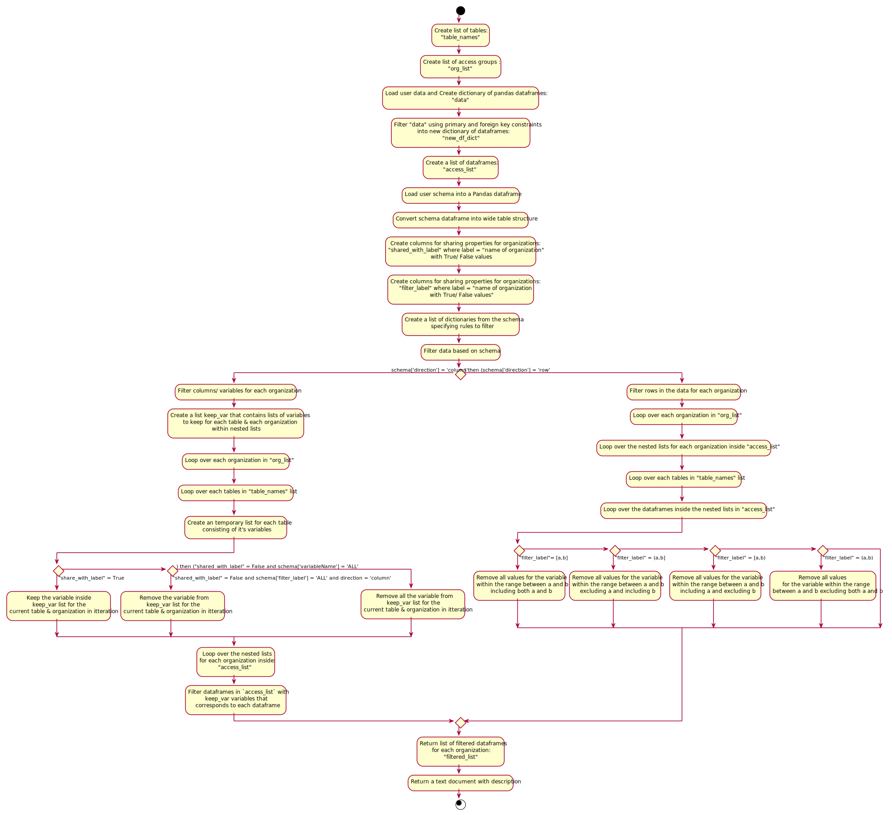

# Aim/Objective:

The purpose of the ODM is to support wastewater-based surveillance and epidemiology by facilitating the collection, standardization, and transparency of data by providing a more harmonized ODM data format to share data between different data curators and data repositories.

The ODM supports data sharing in two ways:

1. **Data sharing schema** - The ODM will have a schema that describes what data can be shared with one or more partners or users.
2. **Data filter based on the data sharing schema** - The ODM will support an open source method for filtering data tables using the data sharing schema.

The data sharing schema will be a csv file (sharing.csv) where each row in the file corresponds to one variable in a ODM table. Attributes in the row describe who the data is shared with and what data is excluded. See below for an example.

The data filter is a Python module (or function) that excludes data based on a data sharing schema. The function accepts an ODM data tables and sharing schema. The function excludes (filters) data variables and rows according to the schema rules. The function then returns a data table with only the data that is to be shared. This new, returned data is ready to be shared and used with a partner.

# Features

High level features include:

- The data custodian should be able to define all the sharing rules in a CSV file (`sharing.csv`). A standard schema for defining the rules will be developed.
- The schema should allow a data custodian to define the partner (organization or person) that each rule pertains to. For example, a certain rule may be applicable only to the Public Health Agency of Canada (PHAC) while another rule may be applicable to not only the PHAC but also to Ottawa Public Health.
- The schema should allow data custodians to define rules that applies to rows or to columns. For example, a rule can be made to exclude all the rows from the `Sample` table or to exclude the `type` column from the `Sample` table.
- Rules can be made within the context of an entire table, to a column that may be present in more than one table or to a column specific to a table.
- The rules may only be exclusive. For example, rules can be defined to remove rows but not to include them. 
- Rules can be combined to form more powerful conditions using logical operators. For example, exclude all rows with `contactEmail` equal to "john.doe@email.com" AND `contactName` equal to "John Doe". Current supported logical operators are `AND` and `OR`.
- The data custodian will be returned a report at the end which will provide details about how many rows were filtered from the data or the individuals and the reasons why they were removed.
- The data custodian will be able to define licenses on how the data can be used by specific users. In many jurisdictions, this is defined in a detailed data-sharing agreement (DSA). The DSA can be short simply referencing a license type, or they can be many pages identifying specifically who can use the data and for what purpose and what will be the data destruction protocols, etc. The license feature or sharing rule will be a free text field and the text field may reference a longer document.
- The implementation should take into account the relationship between the different tables as defined in the ODM. For example, removing a row with siteID 1 from the site table, should also remove all samples with siteID 1 from the samples table. All nested relationships should also be taken care of. The relationships between the tables can be seen [here](https://github.com/Big-Life-Lab/ODM/blob/main/metadata_en.md).
- A python function that implements these rules should be built.

# Sharing CSV

## Introduction

The sharing CSV file provides the different wastewater labs a standardized and code-agnostic method to define rules for sharing their data with different organizations. Each row in the CSV file defines one rule which combined defines all the sharing rules for one wasterwater lab. The headers of the CSV file define the different parts of the rule. The following four sections outline these different parts along with providing a step-by-step guide for defining a rule.

### 1. Selecting an Organization

The first step involves deciding which organizations a rule applies to. This is done using the `sharedWith` column. A unique identifier for each organization should be used and reused throughout the entire document. The different organizations that a rule pertains to should be seperated by a ";". For example, if a rule applies to the **Public Health Agency of Canada** (PHAC) as well as **Ottawa Public Health** (OPH) the value of the `sharedWith` cell in the row for that rule would be `PHAC;OPH`. The example assumes that PHAC and OPH are the agreed upon identifiers to represent these organizations.

### 2. Selecting an Entity

The second step involves selecting the parts of the ODM data model or entities that the rule applies to. The entities that can be selected are:

* Data contained in a table
* Data contained in column(s) of table(s)

This step uses two columns, `tableName` and `variableName`. The `tableName` column can specify the name(s) of the table this rules applies to and the `variableName` column can specify the name(s) of the columns this rule applies to.

Some examples are given below:

1. Selecting the `type` column in the `Sample` table

    | tableName | variableName |
    |-----------|--------------|
    | Sample    | type         |

2. Selecting the `qualityFlag` and the `type` column in the `WWMeasure` table

    | tableName        | variableName        |
    |------------------|---------------------|
    | WWMeasure        | qualityFlag;type    |

3. Selecting all the columns in the `WWMeasure` table

    | tableName        | variableName |
    |------------------|--------------|
    | WWMeasure        | all          |

4. Selecting a the `type` column in the `WWmeasure` and the `Sample` table

    | tableName               | variableName  |
    |-------------------------|---------------|
    | WWMeasure;Sample        | type          |

5. Selecting the `type` column in all tables

    | tableName               | variableName  |
    |-------------------------|---------------|
    | all                     | type          |

Some things to note:

* In examples 2 and 4 where multiple columns and tables were selected respectively, a **;** was used to seperate the values. The same symbol was used to seperate multiple organizations in the previous step. In fact, throughout the entire document when multiple values need to put into a cell, the **;** symbol should be used to seperate them.
* In examples 3 and 5 where all the columns in a table and all the tables were selected respectively, the keyword **all** was used. Similar to the **;** symbol, the keyword **all** may be used in a cell to mean everything.

### 3. Selecting the Direction of the Rule

The third step involves selecting the direction in which the rule should be applied. If we imagine all the ODM data as a set of spreadhseets, with each sheet containing the data for a table, then there are two ways in which a rule can be applied:

1. It can applied by going through each column in the spreadsheet and filtering out those columns that meets the rule's specification
2. It can be applied by going through each row in the spreadsheet and filtering out those rows that meets the rule's specification

This step uses the `direction` column which accepts one of two values, `column` to apply the rule column by column or `row` to apply the rule row by row.

### 4. Selecting the Values to Filter Out

The final step involves inputting the values of the selected entities to filter out. This step uses the `filterValue` column whose values depends on the data type (boolean, numeric etc.) and the statistical type (continuous or categorical) of the variable.

For the statistical type:

* **Continuous Type**: For continuous entities, this column can either specify an interval with a lower and upper limit, a specific value, or a combination of the two. We use the mathematical notation to define an [interval](https://en.wikipedia.org/wiki/Interval_(mathematics)). Examples are:
    * [1, 2]: All values between 1 and 2, inclusive of 1 and 2 will be filtered out
    * (1, 2]: All values between 1 and 2, only inclusive of 2 will be filtered out
    * [1, 2): All values between 1 and 2, only inclusive of 1 will be filtered out
    * (1, 2): All values between 1 and 2, excluding 1 and 2 will be filtered out
    * [Inf, 1]: All values between negative infinity and 1, including 1 will be filtered out
    * [1, Inf]: All values between 1 and positive infinity, including 1 will be filtered out

    The **Inf** keyword can be used to specify infinity either as the lower or upper bound. Combination of values within this column can be entered in by using the **;** symbol again. For example, [1, 2]; (7, 8); 9
* **Categorical Type**: For categorical entities, this column should specify the category values to filter out seperated one again by the **;** symbol

Users can also use the **all** keyword to filter our all values in an entity.

For the data type, please refer to the [ODM metadata](https://github.com/Big-Life-Lab/ODM/blob/main/metadata_en.md#entity-relationship-diagram) on the allowable value for each one.

Some examples are given below,

1. Exclude values of `rawWW` or `swrSed`

    | filterValue             |
    |-------------------------|
    | rawWW;swrSed            |

2. Exclude values between March 1st 2021 and December 1st 2021 including the endpoints

    | filterValue             |
    |-------------------------|
    | [2021-03-01,2021-12-01] |

## Example Scenarios

In this section we will be working with some data, providing an example scenario for a rule and showing what the rule looks like

The data we will be working with has two tables from the ODM, **Sample** and **Site**. It does not include all the columns present in these tables. The rows in the Sample and Site table respectively are shown below:

| sampleID | siteID | dateTime   | type    | sizeL | notes  | 
|----------|--------|------------|---------|-------|--------|
| 1        | 1      | 2021-08-19 | rawWW   | 5     | Note 1 |
| 2        | 1      | 2021-08-18 | sweSed  | 3     | Note 2 |
| 3        | 2      | 2021-08-17 | pstGrit | 15    | Note 3 |
| 4        | 2      | 2020-01-10 | water   | 45    | Note 4 |

| siteID | name                 | publicHealthDepartment | type   |
|--------|----------------------|------------------------|--------|
| 1      | University of Ottawa | Ottawa Public Health   | school |
| 1      | University of Laval  | Laval Public Health    | school |


1. Remove rows whose site ID in the Sample table is 2 for Ottawa Public Health (OPH)

    | sharedWith | tableName | variableName | direction | filterValue |
    |------------|-----------|--------------|-----------|-------------|
    | OPH        | Sample    | siteID       | row       | 1           |

2. Remove rows from the Sample table whose type is `rawWW` or `sweSed` for the Public Health Agency of Canada (PHAC)

    | sharedWith | tableName | variableName | direction | filterValue  |
    |------------|-----------|--------------|-----------|--------------|
    | PHAC       | Sample    | type         | row       | rawWW;sweSed |

3. Remove the type column from all tables for Laval Public Health (LPH)

    | sharedWith | tableName | variableName | direction | filterValue  |
    |------------|-----------|--------------|-----------|--------------|
    | LPH        | all       | type         | column    | all          |

4. Remove samples taken in the year 2021 and those whose volume is less than 5 for OPH and PHAC

    | sharedWith | tableName | variableName | direction | filterValue             |
    |------------|-----------|--------------|-----------|-------------------------|
    | OPH;PHAC   | Sample    | dateTime     | row       | [2021-01-01,2021-12-01] |
    | OPH;PHAC   | Sample    | sizeL        | row       | [Inf,5]                 |

5. Remove the notes column from the Sample table and rows from the Site table that belong to the University of Ottawa for LPH

    | sharedWith | tableName | variableName           | direction | filterValue             |
    |------------|-----------|------------------------|-----------|-------------------------|
    | LPH        | Site      | notes                  | column    | all                     |
    | LPH        | Sample    | publicHealthDepartment | row       | Ottawa Public Health    |

## Sharing CSV Columns

This section summarizes all the columns part of the file

**sharedWith**: The name(s) of the organizations for this rule. Multiple organizations can be seperated by a **;**

**tableName**: The name(s) of the tables for this rule. Allowable values are names of the tables seperated by a **;** or **all** to select all tables.

**variableName**: The name(s) of the columns for this rule. Allowable values are names of the columns seperated by a **;** or **all** to select all columns.

**direction**: The direction to apply the filtering. Allowable values are **row** or **column**.

**filterValue**: The values of the selected entities to exclude. These can include an interval, single values or a combination of both. Multiple values can be seperated using the **;** symbol. **all** can also be used. For intervals, the mathematical notation for it is used.

**description**: Optional description explaining this rule

**license**: The shortform identifier of a license for this data.

# Feature implementation

## How the features will be implemented?

The features that data custodian will request to filter the data through the rules defined in the schema will be implemented using python script that uses `Pandas` library to perform the task. There will be one main function called `create_filtered_dataset(org_group, data, sharing_rules)` that will take in 3 arguments. The org_group is the name of the organization and sharing_rules is the schema which will be of list type. The data argument is of dictionary type. These arguments are provided by the data custodian through web application.

The data custodian enters in the name of the organization that they wish to share their data with.
The data custodian will also provide the data that they want to filter. The data will be a dictionary with keys referencing the table name and values will be list of dictionaries. Each nested dictionary inside the list will correspond to a single row of the table and will only contain one value per key. An example will be:

```
{
    "WWMeasure": [
        {
            "uWwMeasureID": "Measure WW100",
            "SampleID": "Sample S100",
            "type": "covN1",
            "value": 20000,
        },
        {
            "uWwMeasureID": "Measure WW101",
            "SampleID": "Sample S101",
            "type": "covN1",
            "value": 15000,
        },
    ],
    "Sample": [
        {
            "SampleID": "Sample S100",
            "siteID": "Site T100",
            "datetime": "2021-02-01  9:00:00 PM",
            "type": "RawWW",
        },
        {
            "SampleID": "Sample S101",
            "siteID": "Site T101",
            "datetime": "2021-02-01  9:00:00 PM",
            "type": "RawWW",
        },
        {
            "SampleID": "Sample S102",
            "siteID": "Site T102",
            "datetime": "2021-02-01  9:00:00 PM",
            "type": "RawWW",
        },
    ],
    "Lab": [
        {
            "labID": "Lab L100",
            "assayMethodIDDefault": "Assay Y100",
            "name": "University L100 Lab",
        },
        {
            "labID": "Lab L101",
            "assayMethodIDDefault": "Assay Y101",
            "name": "University L100 Lab",
        },
    ],
}
```

Above example of data provides two rows for three different tables 'WWMeasure', 'Sample', and 'Lab'. "WWMeasure" table is represented by a key in the main dictionary. The value is a list of dictionaries. Each dictionary is a row within the `WWMeasure` table. In above example there are two rows. The "Sample" table is another key in main dictionary and it's value is again a list of dictionaries which are the rows in the table. There are 3 dictionaries or rows in the `Sample` list or table. The `Lab` table again has 2 rows or dictionaries within the list.  


The data custodian will provide schema with predefined rules to filter the data. This schema is a list of dictionaries. An example of how schema might look is following:

```
[
    {
        "filterValue": "S101;S102",
        "sharedWith": "Public;PHAC;Local;Provincial;Quebec;OntarioWSI;CanadianWasteWaterDatabase",
        "table": "ALL",
        "variable": "sampleID",
        "direction": "row",
        "ruleID": 1,
    },
    {
        "filterValue": '["2021-01-25", "2021-01-26"); ("2021-01-26","2021-01-31"]',
        "sharedWith": "Public",
        "table": "WWMeasure",
        "variable": "analysisDate",
        "direction": "row",
        "ruleID": 2,
    },
    {
        "filterValue": '2021-01-20; ("2021-01-25", "infinity"]',
        "sharedWith": "PHAC;Local;Provincial;Quebec;OntarioWSI;CanadianWasteWaterDatabase",
        "tableName": "WWMeasure",
        "variableName": "analysisDate",
        "direction": "row",
        "ruleID": 3,
    },
    {
        "filterValue": "siteT101;siteT102",
        "sharedWith": "Public;PHAC;Local;Provincial;Quebec;OntarioWSI;CanadianWasteWaterDatabase",
        "tableName": "ALL",
        "variable": "siteID",
        "direction": "column",
        "ruleID": 4,
    },
    {
        "filterValue": "ALL",
        "sharedWith": "Public;Local",
        "table": "ALL",
        "variable": "contactName;contactEmail;contactPhone;contactPhoneExt",
        "direction": "column",
        "ruleID": 5,
    },
]
```

In above schema there are 5 rules as each dictionary pertains to a single rule. The first rule filters the rows of all tables that have variable name 'sampleID'. The rows filtered are the one that have the value of `sampleID` column set to `S101` 'OR' `S102`. The rows are removed only for the organizations that are mentioned in the `sharedWith` property.

The second rule inside the second dictionary filters all the `analysisDate` values in `WWMeasure` table on 2021-01-25 or between 2021-01-26 to 2021-01-31 excluding the date 2021-01-26. The rows are only removed for the data shared with `Public`. The first and second rule removes rows from the table, therefore, the `direction` property is set to 'row'.

The last or the fifth rule removes all the variables in the `variable` sharing property which are 'contactName','contactEmail','contactPhone', and 'contactPhoneExt' from all the tables only for `Public` and `Local` organizations as mentioned in `sharedWith` property. In this rule, the column is filtered, therefore, the `direction` property is set to 'column'.

The `create_filtered_dataset()` function returns back two things: 
1. The filtered dataset in the form of python dictionary with tables as keys and list of dictionaries as values.
2. The list of dictionaries where each dictionary is the row removed with it's ruleid.

The function does use several sub functions to carry out the filter process using Pandas library . 
Below is the figure that demonstrates the flow of actions in an activity diagram:



The .puml files contains the code for plantuml diagrams.