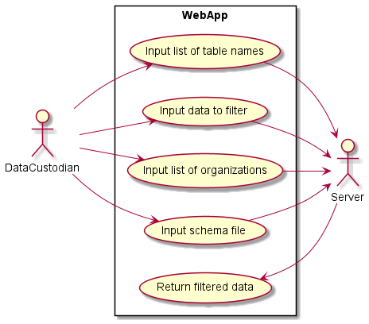
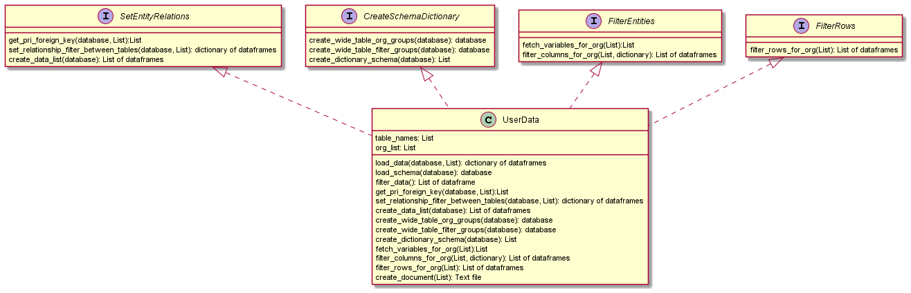

# Aim/Objective:

The purpose of the ODM is to support wastewater-based surveillance and epidemiology by facilitating the collection, standardization, and transparency of data by providing a more harmonized ODM data format to share data between different data curators and data repositories.

The ODM supports data sharing in two ways:

1. **Data sharing schema** - The ODM will have a schema that describes what data can be shared with one or more partners or users.
2. **Data filter based on the data sharing schema** - The ODM will support an open source method for filtering data tables using the data sharing schema.

The data sharing schema will be a csv file (sharing.csv) where each row in the file corresponds to one variable in a ODM table. Attributes in the row describe who the data is shared with and what data is excluded. See below for an example.

The data filter is a Python module (or function) that excludes data based on a data sharing schema. The function accepts an ODM data tables and sharing schema. The function excludes (filters) data variables and rows according to the schema rules. The function then returns a data table with only the data that is to be shared. This new, returned data is ready to be shared and used with a partner.

# Features

High level features include:

- The data custodian should be able to define all the sharing rules in a CSV file (`sharing.csv`). A standard schema for defining the rules will be developed.
- The schema should allow a data custodian to define the partner (organization or person) that each rule pertains to. For example, a certain rule may be applicable only to the Public Health Agency of Canada (PHAC) while another rule may be applicable to not only the PHAC but also to Ottawa Public Health.
- The schema should allow data custodians to define rules that applies to rows or to columns. For example, a rule can be made to exclude all the rows from the `Sample` table or to exclude the `type` column from the `Sample` table.
- Rules can be made within the context of an entire table, to a column that may be present in more than one table or to a column specific to a table.
- The rules may only be exclusive. For example, rules can be defined to remove rows but not to include them. 
- Rules can be combined to form more powerful conditions using logical operators. For example, exclude all rows with `contactEmail` equal to "john.doe@email.com" AND `contactName` equal to "John Doe". Current supported logical operators are `AND` and `OR`.
- The data custodian will be returned a report at the end which will provide details about how many rows were filtered from the data or the individuals and the reasons why they were removed.
- The data custodian will be able to define licenses on how the data can be used by specific users. In many jurisdictions, this is defined in a detailed data-sharing agreement (DSA). The DSA can be short simply referencing a license type, or they can be many pages identifying specifically who can use the data and for what purpose and what will be the data destruction protocols, etc. The license feature or sharing rule will be a free text field and the text field may reference a longer document.
- The implementation should take into account the relationship between the different tables as defined in the ODM. For example, removing a row with siteID 1 from the site table, should also remove all samples with siteID 1 from the samples table. All nested relationships should also be taken care of. The relationships between the tables can be seen [here](https://github.com/Big-Life-Lab/ODM/blob/main/metadata_en.md).
- A python function that implements these rules should be built.

# Sharing CSV

## Introduction

The sharing CSV file provides the different wastewater labs a standardized and code-agnostic method to define rules for sharing their data with different organizations. Each row in the CSV file defines one rule which combined defines all the sharing rules for one wasterwater lab. The headers of the CSV file define the different parts of the rule. The following four sections outline these different parts along with providing a step-by-step guide for defining a rule.

### 1. Selecting an Organization

The first step involves deciding which organizations a rule applies to. This is done using the `sharedWith` column. A unique identifier for each organization should be used and reused throughout the entire document. The different organizations that a rule pertains to should be seperated by a ";". For example, if a rule applies to the **Public Health Agency of Canada** (PHAC) as well as **Ottawa Public Health** (OPH) the value of the `sharedWith` cell in the row for that rule would be `PHAC;OPH`. The example assumes that PHAC and OPH are the agreed upon identifiers to represent these organizations.

### 2. Selecting an Entity

The second step involves selecting the parts of the ODM data model or entities that the rule applies to. The entities that can be selected are:

* Data contained in a table
* Data contained in column(s) of table(s)

This step uses two columns, `tableName` and `variableName`. The `tableName` column can specify the name(s) of the table this rules applies to and the `variableName` column can specify the name(s) of the columns this rule applies to.

Some examples are given below:

1. Selecting the `type` column in the `Sample` table

    | tableName | variableName |
    |-----------|--------------|
    | Sample    | type         |

2. Selecting the `qualityFlag` and the `type` column in the `WWMeasure` table

    | tableName        | variableName        |
    |------------------|---------------------|
    | WWMeasure        | qualityFlag;type    |

3. Selecting all the columns in the `WWMeasure` table

    | tableName        | variableName |
    |------------------|--------------|
    | WWMeasure        | all          |

4. Selecting a the `type` column in the `WWmeasure` and the `Sample` table

    | tableName               | variableName  |
    |-------------------------|---------------|
    | WWMeasure;Sample        | type          |

5. Selecting the `type` column in all tables

    | tableName               | variableName  |
    |-------------------------|---------------|
    | all                     | type          |

Some things to note:

* In examples 2 and 4 where multiple columns and tables were selected respectively, a **;** was used to seperate the values. The same symbol was used to seperate multiple organizations in the previous step. In fact, throughout the entire document when multiple values need to put into a cell, the **;** symbol should be used to seperate them.
* In examples 3 and 5 where all the columns in a table and all the tables were selected respectively, the keyword **all** was used. Similar to the **;** symbol, the keyword **all** may be used in a cell to mean everything.

### 3. Selecting the Direction of the Rule

The third step involves selecting the direction in which the rule should be applied. If we imagine all the ODM data as a set of spreadhseets, with each sheet containing the data for a table, then there are two ways in which a rule can be applied:

1. It can applied by going through each column in the spreadsheet and filtering out those columns that meets the rule's specification
2. It can be applied by going through each row in the spreadsheet and filtering out those rows that meets the rule's specification

This step uses the `direction` column which accepts one of two values, `column` to apply the rule column by column or `row` to apply the rule row by row.

### 4. Selecting the Values to Filter Out

The final step involves inputting the values of the selected entities to filter out. This step uses the `filterValue` column whose values depends on the data type (boolean, numeric etc.) and the statistical type (continuous or categorical) of the variable.

For the statistical type:

* **Continuous Type**: For continuous entities, this column can either specify an interval with a lower and upper limit, a specific value, or a combination of the two. We use the mathematical notation to define an [interval](https://en.wikipedia.org/wiki/Interval_(mathematics)). Examples are:
    * [1, 2]: All values between 1 and 2, inclusive of 1 and 2 will be filtered out
    * (1, 2]: All values between 1 and 2, only inclusive of 2 will be filtered out
    * [1, 2): All values between 1 and 2, only inclusive of 1 will be filtered out
    * (1, 2): All values between 1 and 2, excluding 1 and 2 will be filtered out
    * [Inf, 1]: All values between negative infinity and 1, including 1 will be filtered out
    * [1, Inf]: All values between 1 and positive infinity, including 1 will be filtered out

    The **Inf** keyword can be used to specify infinity either as the lower or upper bound. Combination of values within this column can be entered in by using the **;** symbol again. For example, [1, 2]; (7, 8); 9
* **Categorical Type**: For categorical entities, this column should specify the category values to filter out seperated one again by the **;** symbol

Users can also use the **all** keyword to filter our all values in an entity.

For the data type, please refer to the [ODM metadata](https://github.com/Big-Life-Lab/ODM/blob/main/metadata_en.md#entity-relationship-diagram) on the allowable value for each one.

Some examples are given below,

1. Exclude values of `rawWW` or `swrSed`

    | filterValue             |
    |-------------------------|
    | rawWW;swrSed            |

2. Exclude values between March 1st 2021 and December 1st 2021 including the endpoints

    | filterValue             |
    |-------------------------|
    | [2021-03-01,2021-12-01] |

## Example Scenarios

In this section we will be working with some data, providing an example scenario for a rule and showing what the rule looks like

The data we will be working with has two tables from the ODM, **Sample** and **Site**. It does not include all the columns present in these tables. The rows in the Sample and Site table respectively are shown below:

| sampleID | siteID | dateTime   | type    | sizeL | notes  | 
|----------|--------|------------|---------|-------|--------|
| 1        | 1      | 2021-08-19 | rawWW   | 5     | Note 1 |
| 2        | 1      | 2021-08-18 | sweSed  | 3     | Note 2 |
| 3        | 2      | 2021-08-17 | pstGrit | 15    | Note 3 |
| 4        | 2      | 2020-01-10 | water   | 45    | Note 4 |

| siteID | name                 | publicHealthDepartment | type   |
|--------|----------------------|------------------------|--------|
| 1      | University of Ottawa | Ottawa Public Health   | school |
| 1      | University of Laval  | Laval Public Health    | school |

1. Remove rows whose site ID in the Sample table is 2 for Ottawa Public Health (OPH)

    | sharedWith | tableName | variableName | direction | filterValue |
    |------------|-----------|--------------|-----------|-------------|
    | OPH        | Sample    | siteID       | row       | 1           |

2. Remove rows from the Sample table whose type is `rawWW` or `sweSed` for the Public Health Agency of Canada (PHAC)

    | sharedWith | tableName | variableName | direction | filterValue  |
    |------------|-----------|--------------|-----------|--------------|
    | PHAC       | Sample    | type         | row       | rawWW;sweSed |

3. Remove the type column from all tables for Laval Public Health (LPH)

    | sharedWith | tableName | variableName | direction | filterValue  |
    |------------|-----------|--------------|-----------|--------------|
    | LPH        | all       | type         | column    | all          |

4. Remove samples taken in the year 2021 and those whose volume is less than 5 for OPH and PHAC

    | sharedWith | tableName | variableName | direction | filterValue             |
    |------------|-----------|--------------|-----------|-------------------------|
    | OPH;PHAC   | Sample    | dateTime     | row       | [2021-01-01,2021-12-01] |
    | OPH;PHAC   | Sample    | sizeL        | row       | [Inf,5]                 |

5. Remove the notes column from the Sample table and rows from the Site table that belong to the University of Ottawa for LPH

    | sharedWith | tableName | variableName           | direction | filterValue             |
    |------------|-----------|------------------------|-----------|-------------------------|
    | LPH        | Site      | notes                  | column    | all                     |
    | LPH        | Sample    | publicHealthDepartment | row       | Ottawa Public Health    |

## Sharing CSV Columns

This section summarizes all the columns part of the file

**sharedWith**: The name(s) of the organizations for this rule. Multiple organizations can be seperated by a **;**

**tableName**: The name(s) of the tables for this rule. Allowable values are names of the tables seperated by a **;** or **all** to select all tables.

**variableName**: The name(s) of the columns for this rule. Allowable values are names of the columns seperated by a **;** or **all** to select all columns.

**direction**: The direction to apply the filtering. Allowable values are **row** or **column**.

**filterValue**: The values of the selected entities to exclude. These can include an interval, single values or a combination of both. Multiple values can be seperated using the **;** symbol. **all** can also be used. For intervals, the mathematical notation for it is used.

**description**: Optional description explaining this rule

**license**: The shortform identifier of a license for this data.

# Feature implementation

### How the features will be implemented?
The features that data custodian will request to filter the data through the rules defined in the schema will be implemented using python script that uses `Pandas` library to perform the task. The use case of the ODM conductor for sharing is given in figure below. 

The data custodian will use the web application tool to input in a list of table names separated by comma. It will be entered in a list structure. An example is ['WWMeasure', 'Sample', 'SiteMeasure', 'Lab']. The data custodian will enter in a list of organizations to share data with which is again separated by comma. An example is ['Public', 'PHAC', 'Local']. All the names inside the lists will be written inside quotes. The data custodian will also provide the data that they want to filter and the schema file that defines the rules to filter the data. All the inputs from the data custodian will be received by the backend server that will run the python script and use `Pandas` to filter the data and return the modified data back to the data custodian. The backend server will also return a text document that provides details about what columns/ rows were filtered from the data and the reasons to filter along with any license information associated with the data.

A sequence flow diagram further demonstrates the flow of process: 

Below is a diagram of how the classes will be implemented in python to perform the backend tasks to filter the data:

The python script will use a main class `UserData` and four interface classes named `SetEntityRelations`, `CreateSchemaDictionary`, `FilterEntities`, and `FilterRows`. The main attributes of the `UserData` class are `table_names` and `org_list` which accepts in the values of the table names and organization list entered in by the data custodian. 
UserData class has two of it's own main methods:
- **load_data(database, list)** which accepts in the data and the list of table names that data custodian provides. It returns a dictionary of Pandas dataframes where each key is for each table requested and the value specifies the dataframe that corresponds to that table.
- **load_schema(database)** which accepts in the schema file and will then output a Pandas dataframe of that schema.
- **filter_data()** This method basically implements all the other methods from interface classes and then output back the list of filtered dataframes for each organization in nested lists called `filtered_list`.
- **create_document(List)** which accepts lists that specifies the rows or variables removed and the reasons for removal with filter condition. The license associated with the particular table or variables for specific groups is also provided. It outputs a text file that contains all these information.

The `UserData` class implements the four interface class and is therefore, a realization of these interface classes. The interface `SetEntityRelations` class provides two main functions:
- **get_pri_foreign_key(database)** will accept the dataframe created using variable.csv file and the list of table names data custodian provides as the input data and returns two lists for both primary keys and foreign keys for each table requested in a sequence within nested lists inside the main lists.
- **set_entity_filter_between_tables** will accept the dictionary of dataframes returned from the load_data method, the list of table names, the primary and foreign key lists entered returned by the above method. It will return the dictionary of dataframes which is filtered for any primary key and foreign key constraints.
- **create_data_list(database)** will accept list of dataframes filtered by the method above and then output back the list of dataframes for each organization requested by user. Each organization will be a nested list inside the main list that contains the dataframes for requested tables. The output list is called `access_list`.

The `UserData` class will then implement the `CreateSchemaDictionary` class which will create a json like dictionary for the schema. The interface provides three main methods:
- **create_wide_table_org_groups(database)** will accept the dataframe created by load_schema function and then output back a dataframe with wide table structure. It contains separate sharing property for each organization which allows to filter the data effectively such as `shared_with_label` where label = name of organization. 
- **create_wide_table_filter_groups(database)** will accept the dataframe created by above method and will output back a dataframe with wide table structure. In this method, the filter sharing properties are created for each organization for ease of filtering. An example will be `filter_with_label` where label = name of organization.
- **create_dictionary_schema(database)** will accept the dataframe created by above method and then output a list of dictionaries called `schema_list`. Here, each dictionary is a rule that will filter either a specific column or a row of the dataset.

The next interface class that gets implemented is `FilterEntities` which provides the methods to filter columns/ variables in the dataset. The class provides two main methods:
- **fetch_variables_for_org** will accept three lists: list of dictionaries, `schema_list`, the list of organizations, and the list of table names requested by user. The output will be the list called `keep_var` that contains variables for each organization and table inside nested lists based on schema specified rules.
- **filter_columns_for_org** will accept the list `keep_var`, the list of table names, the list of organizations, and the list of dataframes outputed by the `access_list` method. The method filters for the variables/ columns in the dataset. It will then output a list of dataframes filtered by the keep_var lists of variables. Each nested list inside the main list will correspond to a specific organization group. The dataframes inside the nested lists will only contain the variables that can be accessed by those organizations. 

The last interface implemented by `UserData` class is `FilterRows` class which will implement `filter_rows_for_org(list)` method. This method takes in the input of list of dataframes created above called `access_list`, it takes in the list of tables names, the list of organizations, and the list of schema dictionary `schema_list`. The function filters the rows of the dataset based on schema defined rules for each organization specified in the `filter_label` sharing property created in the wide table structure. It finally outputs a list of dataframes called `filtered_list` which contains nested lists for each organization. The filtered list returned will contain only those rows for each organization and table that are allowed as per the schema rules.

Below is the figure that demonstrates the flow of actions in an activity diagram:

First a list of table names that user specifies is stored into a variable named `table_names`. Next a list of organizations that user specifies is stored into a variable named `org_list`. The data is loaded into a dictionary of dataframes called `data`. The data is then filtered using primary and foreign key constraints into a dictionary of dataframes called `new_df_dict`. The data is then stored into a list `access_list` that consists of the dataframes for the requested tables within nested lists. Each nested list corresponds to the organizations requested by the user in org_list.

The user schema file is loaded into a pandas dataframe. The schema is converted into a wide table format for ease of coding with Pandas to filter the data. The `shared_with` property with multiple organizations in one row is converted into wide table format where each organization has it's own column for sharing property. Examples include `shared_with_PHAC` or `shared_with_Local`, etc. The wide format for each organization is applied to filter sharing property with extra columns created such as `filter_PHAC`, `filter_Provincial`, etc.

The data is then filtered based on schema specified rules in the filter_data method of the main class `UserData`. If the `direction` sharing rule is equal to columns, then the columns or variables are filtered from the data. Else, if the `direction` sharing property is rows, then specific rows are removed based on specific information provided in the filter_value sharing property.

In both the cases we loop over the table_names and org_list to selectively filter each table for each organization based on the filter property that has been set. If the value of organization specific sharing property in the schema dictionary for the current table and organization in itteration is set to `False` such as `shared_with_label` = False and the filter sharing property `filter_label` = "ALL" then the variable is removed from the dataframe for the specific organization. If the schema sharing property `variableName` is set to "ALL" for specific organization with `shared_with_label` set to False, then the entire table is removed for the particular organization. Else, the variable is kept in the dataframe.

In case of row filteration, if the value of filter property for specific organization in current itteration such as `filter_label` = [a,b] then the range between and inclusive of both a and b is filtered. If the `filter_label`= (a,b] then the range between a and b is filtered inclusive of b and excluding a. Else, if the `filter_label`= [a,b) then the range between a and b is filtered inclusive of a and excluding b. The `filter_label` = (a,b) excludes both a and b when filtering the interval from the dataframe.

The final output is the `filtered_list` that contains data for each table and organization which will be returned to the data custodian in their requested file format. The other output will be the text file that will provide details about the columns and rows filtered along with description of the rules used to filter them and the license associated with the data usage.

The .puml files contains the code for plantuml diagrams.